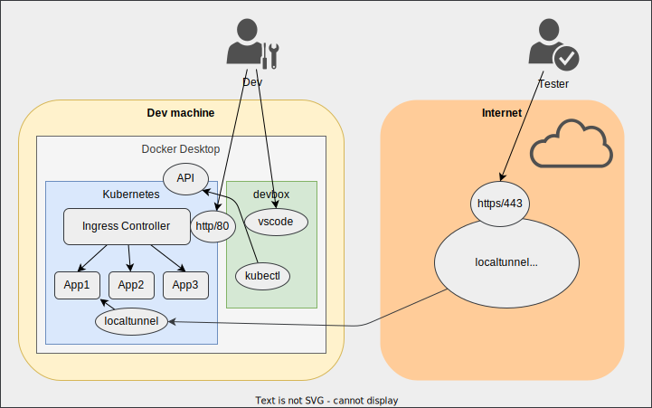

# local development cluster

**This is work in progress**

A short way to get a local kubernetes development cluster up and running on a local machine with Docker Desktop and expose apps to the internet for testing purposes.

Do **not** clone this repo now. We do this later in the devbox container.

## Architecture



## Prerequisites

- Docker Desktop: https://www.docker.com/products/docker-desktop/

Activate Kubernetes on Docker Desktop:

-> Docker Desktop -> Preferences -> Kubernetes -> Enable Kubernetes

## Start the devbox container

Linux/MacOS:
```bash
docker run -d --hostname devbox -p 2080:2080 --rm \
  -v devboxhome:/home/coder \
  -v ${HOME}/.kube/config:/home/coder/.kube/config \
  --name local-k8s-devbox \
  isi006/code-server-k8s:latest
```
Windows:
```
docker run -d --hostname devbox -p 2080:2080 --rm -v devboxhome:/home/coder -v %userprofile%/.kube/config:/home/coder/.kube/config --name local-k8s-devbox isi006/code-server-k8s:latest
```
Visit http://localhost:2080/ to access the devbox IDE.

Open a terminal and check if it works:

```bash
kubectl cluster-info
```
## Clone the repo in the devbox

```bash
git clone https://github.com/klauserber/local-k8s.git
```

## Minimal infrastructure setup

### configure

```bash
cp config.yml_template config.yml
```

Edit the config file to choose your domain suffix to build unique localtunnel subdomains.

### install ingress-nginx

-> https://artifacthub.io/packages/helm/ingress-nginx/ingress-nginx

```bash
cd ingress-nginx
./run.sh
```

check if it works:

```bash
kubectl get all -n ingress-nginx
```

## Test the system with the hello-app

### Deploy the app

```bash
cd hello-app
./run.sh
```

### Testing

```bash
kubectl get all -n hello-app
```

Visit http://hello.127.0.0.1.nip.io for local access. <br>
Visit https://hello{{public_domain_suffix}} for public access.

### Undeploy the app

```bash
./run.sh -d
```

## Optional: Deploy portainer

You can install Portainer to get more insights about the cluster.

```bash
cd portainer
./run.sh
```
Visit the app at http://portainer.127.0.0.1.nip.io

## Next steps?

This is a good starting point to play around with kubernetes on your local machine. So what can you do next?

* Inspect the code to figure out how it works. It is not so intensive.
* If you need help go to https://kubernetes.io in the first place.
* Deploy more apps, it is a big ecosystem, have a look at https://artifacthub.io
* Containerize your own app (https://docs.docker.com/engine/reference/builder/) and deploy it.
* Learn how to package your app with all needed Kubernetes objects with Helm (https://helm.sh/) or Kustomize (https://kustomize.io/)
